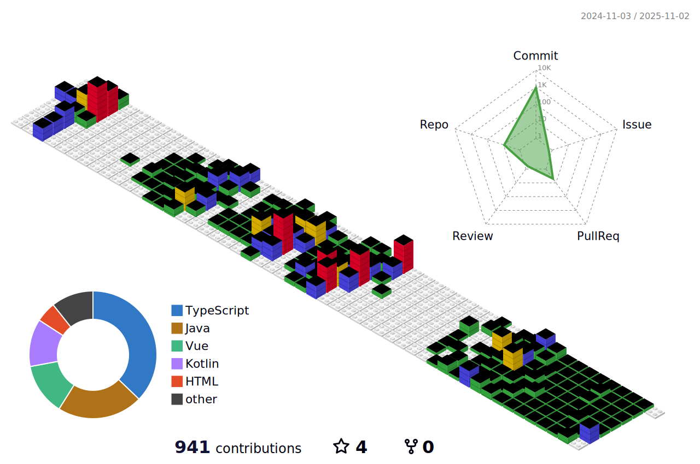

<!--
**rnjs010/rnjs010** is a ✨ _special_ ✨ repository because its `README.md` (this file) appears on your GitHub profile.
-->

<!-- 해더 -->

<!-- 소개 -->
# 🙋🏻‍♀️ About Me
<!--
### Social

 

 

 
 
-->

### Social

 

 

소개 글 추가하기

  

<!-- 기술 스택 -->
# 🛠 Tech Stack
### Frontend (Main)

 

### Backend (Study)

### Languages (Etc)

### Development Tools

 

### 👥 Collaboration Tools

  

<!-- 프로젝트 -->
# 📽️ Projects

<table>
  <tr>
    <td align="center" style="padding: 5px;">
      
    </td>
    <td align="center" style="padding: 5px;">
      
    </td>
  </tr>
  <tr>
    <td align="center" style="padding: 5px;">
      
    </td>
    <td align="center" style="padding: 5px;">
      
    </td>
  </tr>
</table>

  

<!-- 통계 -->
# 📊 Stats

  

  
  
  

<!-- 3d 잔디 -->

